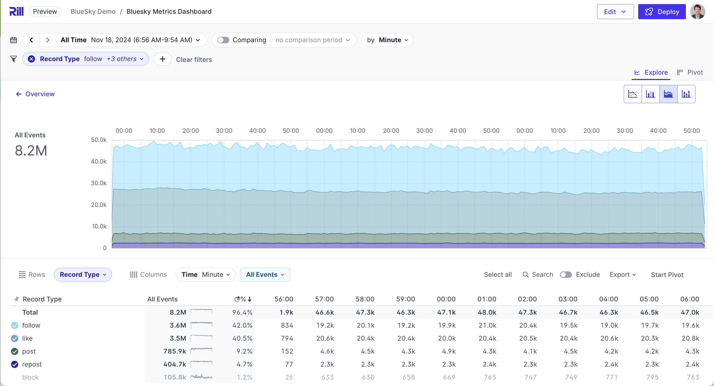

# rill-bluesky

A demo of Rill dashboards exploring BlueSky metrics.

This dashboard is currently live on [ Rill Cloud ]( https://ui.rilldata.com/demo/rill-bluesky/explore/bluesky_dashboard )



## How to clone and run this project locally in Rill Developer

You can clone and run this dashboard locally, and deploy your own version if you desire.

* Download Rill Developer

```
curl https://rill.sh | sh
```

* Launch Rill with this project's Github URI

```
rill start https://github.com/rilldata/rill-bluesky.git
```

Rill will clone the Github project locally and launch in a new browser window.


## How to make changes to these dashboards

You can refine the metrics and dimensions visible in the dashboard by editing YAML
files within Rill Developer, and previewing those changes locally.

If you've got any improvements, make a pull request on this repo and we'll likely accept it.
(The published dashboards are automatically synced with the repo after each commit).

## Special thanks

* [Jake Thomas]( https://bsky.app/profile/jakthom.bsky.social) for making Jetstream data available as Parquet.


